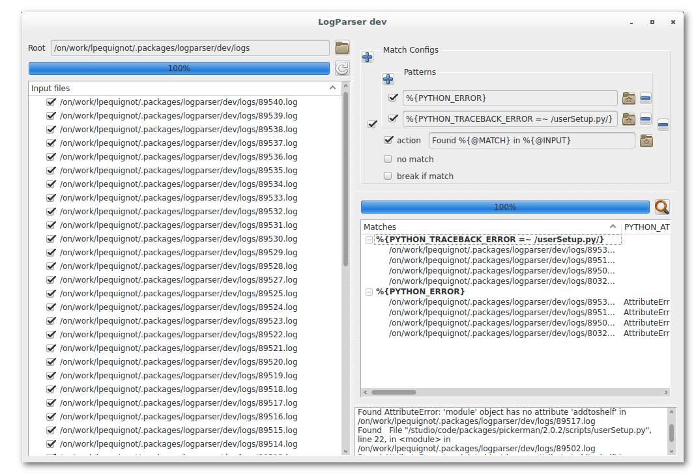

==============================
Python Log Parser
==============================

pattern matching/tool that allow to easily parse log and others files.

logparser UI
========================

logparser command line
========================

.. code-block:: python

    # save analyze as ouytput file
    >>> logparser -r /studio/code/packages/coalition/latest/src/logs -v -o '/tmp/analyze.log'

    # echo @MATCH and @LINE for each GUERILLA_ERROR pattern match
    >>> logparser -r /studio/code/packages/coalition/latest/src/logs -p GUERILLA_ERROR -a 'echo Found %{@MATCH} in %{@LINE}'

    # echo @PATTERNS for each PYTHON_ERROR pattern match
    >>> logparser -r /studio/code/packages/coalition/latest/src/logs -p PYTHON_ERROR -a 'echo %{@PATTERNS}'

    # echo @MATCH and @LINE for each match DATE : %{DATE}[- ]%{HOUR}:%{MINUTE}
    >>> logparser -r /studio/code/packages/coalition/latest/src/logs -m "DATE : %{DATE}[- ]%{HOUR}:%{MINUTE}" -a 'echo Found %{@MATCH} in %{@LINE}'

    # echo @MATCH and @LINE for each PYTHON_ERROR which startswith AttributeError
    >>> logparser -m '%{PYTHON_ERROR =~ /^AttributeError/}' -a 'echo Found %{@MATCH} in %{@LINE}'

    # echo @MATCH and @LINE for each PYTHON_ERROR wich contains userSetup.py
    >>> logparser -m '%{PYTHON_TRACEBACK_ERROR =~ /userSetup.py/}' -a 'echo Found %{@MATCH} in %{@LINE}'

    # echo @PATTERNS for each REZ_PACKAGE_VERSION == REZ_ONMAYAUTILS_VERSION=0.1.126
    >>> logparser -m '%{REZ_PACKAGE_VERSION $== REZ_ONMAYAUTILS_VERSION=0.1.126}' -a 'echo %{@PATTERNS}'

    # echo @PATTERNS for each source file ending with .env or each REZ_PACKAGE_VERSION matching REZ_GITLABUTILS_VERSION=0.0.17
    >>> logparser -m 'source %{PATH =~ /.env$/}' '%{REZ_PACKAGE_VERSION $== REZ_GITLABUTILS_VERSION=0.0.17}' -a 'echo %{@PATTERNS}'

    # execute updatejobenv %{@INPUT} on each job with dispatcher-dev in REZ_USED_RESOLVE
    >>> logparser -m '%{REZ_USED_RESOLVE =~ /dispatcher-dev/}' -r /studio/code/packages/coalition/latest/src/logs -a 'updatejobenv -l %{@INPUT}'

    # apply shellescape filter on %{@PATTERNS} captured data
    >>> logparser -m '%{DATE}[- ]%{HOUR}:%{MINUTE}' -a 'python -c "print(\"Result is : \" + %{@PATTERNS|shellescape})"'

    # apply jsonencode filter on %{@JSON} capture data
    >>> logparser -m '%{DATE}[- ]%{HOUR}:%{MINUTE}' -a 'python -c "print(\"Result is : \" + %{@JSON|jsonencode})"'

Create program with input files
-------------------------------

.. code-block:: python

    from logparser.core import Program, MatchConfig

    mcworker = MatchConfig(
          patterns=['%{COALITION_JOB_WORKER}'],
          action='Found worker %{COALITION_JOB_WORKER}=%{@PATTERNS};')

    mcdate = MatchConfig(
          patterns=['%{COALITION_JOB_DATETIME}'],
          action='Found datetime %{COALITION_JOB_DATETIME}=%{@PATTERNS};')

    mcexitcode = MatchConfig(
          patterns=['%{COALITION_JOB_EXITCODE}'],
          action='Found exitcode %{COALITION_JOB_EXITCODE}=%{@PATTERNS};')

    pg = Program(name='Log Parser', matchconfigs=[mcworker, mcdate, mcexitcode])
    for log in sorted(logs):
        pg.addinputfile(filepath=log)

Create program with input process
----------------------------------

.. code-block:: python

    from logparser.core import Program, MatchConfig

    mc = MatchConfig(patterns=['time=%{NUMBER:time}'],
                action='%{@JSON}')

    pg = Program(name='Ping Google', matchconfigs=[mc])
    command ='ping -c 1 www.google.ca'
    pg.addinputprocess(command=command)

Actions
----------------------------------
Actions can reference named patterns from the match or special values as follow :

**%{@LINE}**

The line matched

.. code-block:: python
    
    # matching  "DATE : %{DATE}[- ]%{HOUR}:%{MINUTE}" in * DATE : 17-08-07 17:43 GMT-0400 (EDT)
    # with action 'echo line=%{@LINE}'
    line=* DATE : 17-08-07 18:02 GMT-0400 (EDT)

**%{@MATCH}**

The substring matched

.. code-block:: python

    # matching  "DATE : %{DATE}[- ]%{HOUR}:%{MINUTE}" in * DATE : 17-08-07 17:43 GMT-0400 (EDT)
    # with action 'echo match=%{@MATCH}'
    match=DATE : 17-08-07 18:02

**%{@START}**

The starting position of the match

.. code-block:: python

    # matching  "DATE : %{DATE}[- ]%{HOUR}:%{MINUTE}" in * DATE : 17-08-07 17:43 GMT-0400 (EDT)
    # with action 'echo start=%{@START}'
    start=2

**%{@END}**

The ending position of the match

.. code-block:: python

    # matching  "DATE : %{DATE}[- ]%{HOUR}:%{MINUTE}" in * DATE : 17-08-07 17:43 GMT-0400 (EDT)
    # with action 'echo end=%{@END}'
    end=23

**%{@LENGTH}**

The length of the match

.. code-block:: python

    # matching  "DATE : %{DATE}[- ]%{HOUR}:%{MINUTE}" in * DATE : 17-08-07 17:43 GMT-0400 (EDT)
    # with action 'echo length=%{@LENGTH}'
    length=21

**%{@PATTERNS}**

The list of all patterns captured and subnames

.. code-block:: python

    # matching  "DATE : %{DATE}[- ]%{HOUR}:%{MINUTE}" in * DATE : 17-08-07 17:43 GMT-0400 (EDT)
    # with action 'echo patterns=%{@PATTERNS}'
    patterns={HOUR: 18, DATE_US: null, MONTHNUM: 08, DATE_EU: 17-08-07, YEAR: 07, DATE: 17-08-07, MONTHDAY: 17, MINUTE: 03}

**%{@INPUT}**

The input file/process name

.. code-block:: python

    # matching  "DATE : %{DATE}[- ]%{HOUR}:%{MINUTE}" in * DATE : 17-08-07 17:43 GMT-0400 (EDT)
    # with action 'echo input=%{@INPUT}'
    input=/studio/code/packages/coalition/latest/src/logs/100170.log

**%{@JSON}**

The full set of patterns, matching substring and line

.. code-block:: python

    # matching  "DATE : %{DATE}[- ]%{HOUR}:%{MINUTE}" in * DATE : 17-08-07 17:43 GMT-0400 (EDT)
    # with action 'echo json=%{@JSON}'
    json=[{@LINE: * DATE : 17-08-07 17:55 GMT-0400 (EDT)}, {@MATCH: DATE : 17-08-07 17:55}, {HOUR: 17}, {DATE_US: null}, {MONTHNUM: 08}, {DATE_EU: 17-08-07}, {YEAR: 07}, {DATE: 17-08-07}, {MONTHDAY: 17}, {MINUTE: 55}]

**%{@JSON_COMPLEX}**

Similar to **%{@JSON}**, but includes start end end position for every named pattern

.. code-block:: python

    # matching  "DATE : %{DATE}[- ]%{HOUR}:%{MINUTE}" in * DATE : 17-08-07 17:43 GMT-0400 (EDT)
    # with action 'echo jsoncomplex=%{@JSON_COMPLEX}'
    jsoncomplex=[{@LINE: {start: 0, end: 38, value: * DATE : 17-08-07 18:03 GMT-0400 (EDT)}}, {@MATCH: {start: 2, end: 23, value: DATE : 17-08-07 18:03}}, {HOUR: {start: 18, end: 20, value: 18}}, {DATE_US: {start: -1, end: -1, value: null}}, {MONTHNUM: {start: 12, end: 14, value: 08}}, {DATE_EU: {start: 9, end: 17, value: 17-08-07}}, {YEAR: {start: 15, end: 17, value: 07}}, {DATE: {start: 9, end: 17, value: 17-08-07}}, {MONTHDAY: {start: 9, end: 11, value: 17}}, {MINUTE: {start: 21, end: 23, value: 03}}]

Predicates
----------------------------------

Predicates allow to add additional requirements to matches.

example : **%{NUMBER > 10}** match number greater than 10.

- numerical comparaison predicates : ``> < >= <= == !=``
- string comparaison predicates : ``$> $< $>= $<= $== $!=``
- regex expressions predicates : ``=~ !~``

.. code-block:: python

    from logparser.core import Grok

    grok = Grok()

    # number comparaison predicates
    grok.compile('^%{NUMBER>10.0}$')
    grok.match('0')
    grok.match('10.1')

    # string comparaison predicates
    grok.compile('^%{WORD$==hello}')
    grok.match('nothello')
    grok.match('hello')

    # regex expression predicates
    # syntax is %{name=~/regexp/} or  %{name!~/regexp/}

    grok.compile('^%{WORD=~/^hello/}')
    grok.match('hallo')
    grok.match('hhelloo')

